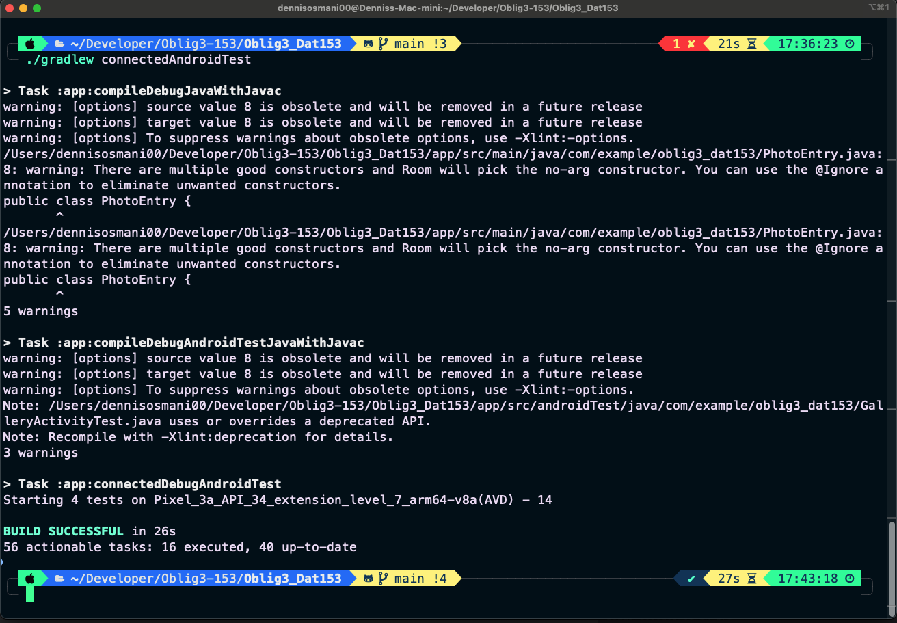
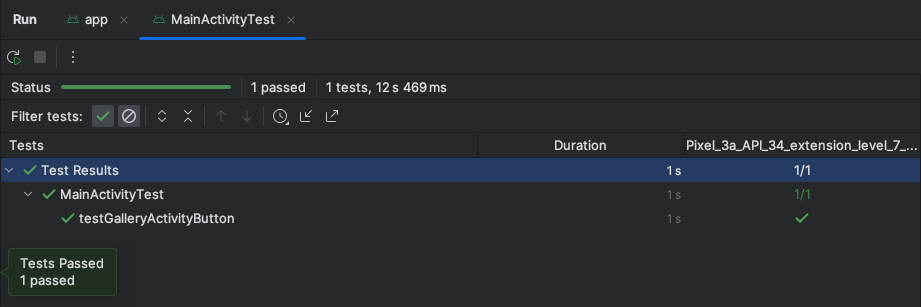
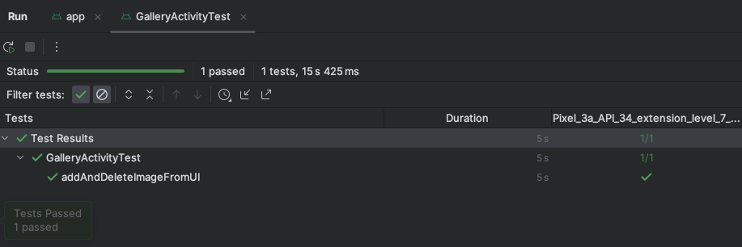
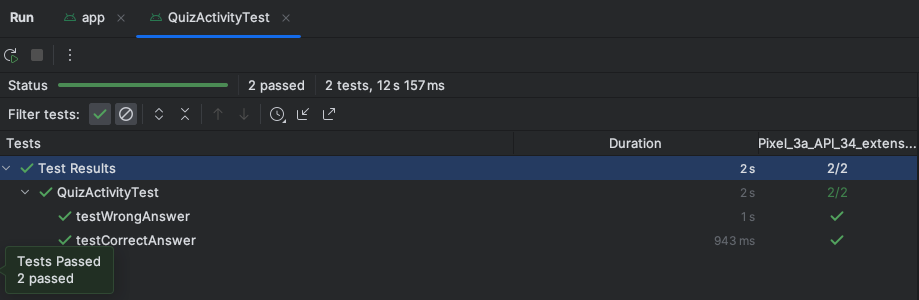

# Oblig3_Dat153

## Test Results

After running

```sh
./gradlew connectedAndroidTest
```

we got the following results



### What happends after we run the command

yapp yapp

<hr />

## Test Cases

**MainActivityTest**
Tests that the button for navigating to GalleryActivity is triggered
on click and that the Activity is launched.



<br />

**GalleryActivityTest**
Tests adding a image, validating that the image is added to the UI,
then deletes it and validates the UI again.



<br />

**QuizActivityTest**
Tests that clicking on a button gives the correct score by matching
the score on the screen.


